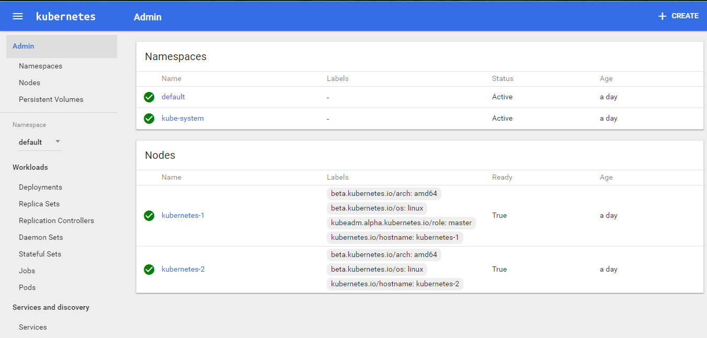
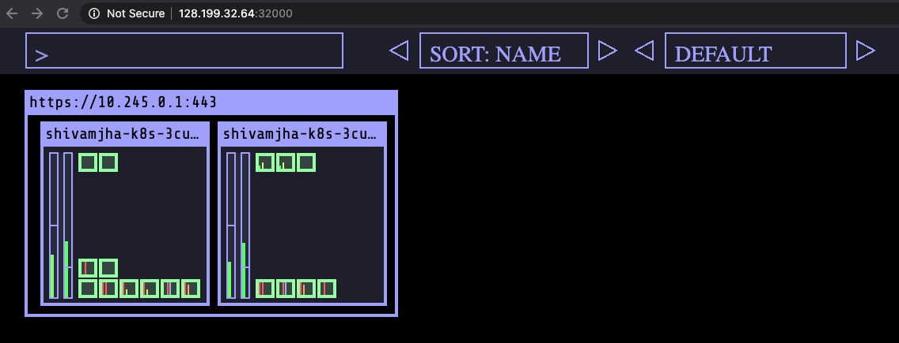

#           Kubernetes Cluster Setup with Kubeadm on Ubuntu
                               

This documents describes how to setup kubernetes from scratch on your own nodes, without using a managed service. This setup uses kubeadm to install and configure kubernetes cluster. We will install and configure a Kubernetes cluster consisting of 1 master and 2 nodes. Once the installation and configuration are complete, we will have a 3-node Kubernetes cluster that uses Calico,WeaveNet & Flannel as the network overlay.

https://kubernetes.io/docs/setup/production-environment/tools/kubeadm/install-kubeadm/

## Compatibility

Kubernetes is an open-source system for automating deployment, scaling, and management of containerized applications.

The below steps are applicable for the below mentioned OS


| OS | Version | Codename |  
| --- | --- | -- |  
| **Ubuntu** | **16.04 / 18.04** | **Xenial** | 

## Base Setup
 ```
 Download Oracle VirtualBox:  https://www.virtualbox.org/wiki/Downloads
 Download VM images: http://osboxes.org/
 Download MobaXterm SSH terminal for Windows https://mobaxterm.mobatek.net/download-home-edition.html
 Visual Studio Code a code editor https://code.visualstudio.com/download
 ```
 **On all nodes which would be part of this cluster, you need to do the base setup as described in the following steps. To simplify this, you could also**
[download and run this script](https://gist.github.com/initcron/40b71211cb693f541ce35fe3fb1adb11)
 
                  Note: Complete the following section on both MASTER & Worker Node !
                              
## Letting iptables see bridged traffic

As a requirement for your Linux Node's iptables to correctly see bridged traffic, you should ensure `net.bridge.bridge-nf-call-iptables` is set to 1 in your `sysctl` config, e.g.

```bash
cat <<EOF | sudo tee /etc/sysctl.d/k8s.conf
net.bridge.bridge-nf-call-ip6tables = 1
net.bridge.bridge-nf-call-iptables = 1
EOF
sudo sysctl --system
sudo sysctl -p
```

## Check required ports

### Control-plane node(s)

| Protocol | Direction | Port Range | Purpose                 | Used By                   |
|----------|-----------|------------|-------------------------|---------------------------|
| TCP      | Inbound   | 6443*      | Kubernetes API server   | All                       |
| TCP      | Inbound   | 2379-2380  | etcd server client API  | kube-apiserver, etcd      |
| TCP      | Inbound   | 10250      | Kubelet API             | Self, Control plane       |
| TCP      | Inbound   | 10251      | kube-scheduler          | Self                      |
| TCP      | Inbound   | 10252      | kube-controller-manager | Self                      |

### Worker node(s)

| Protocol | Direction | Port Range  | Purpose               | Used By                 |
|----------|-----------|-------------|-----------------------|-------------------------|
| TCP      | Inbound   | 10250       | Kubelet API           | Self, Control plane     |
| TCP      | Inbound   | 30000-32767 | NodePort Services†    | All                     |

† Default port range for [NodePort Services]

Any port numbers marked with * are overridable, so you will need to ensure any
custom ports you provide are also open.

Although etcd ports are included in control-plane nodes, you can also host your own
etcd cluster externally or on custom ports.


### Install Docker runtime, To run containers in Pods, Kubernetes uses a container runtime.
## Docker

On each of your machines, install Docker. Version 19.03.8 is recommended, but 1.13.1, 17.03, 17.06, 17.09, 18.06 and 18.09 are known to work as well.
Keep track of the latest verified Docker version in the Kubernetes release notes.
Use the following commands to install Docker on your system:

```shell
# (Install Docker CE)
## Set up the repository:
### Install packages to allow apt to use a repository over HTTPS
apt-get update && apt-get install -y \
  apt-transport-https ca-certificates curl software-properties-common gnupg2
```

```shell
# Add Docker’s official GPG key:
curl -fsSL https://download.docker.com/linux/ubuntu/gpg | apt-key add -
```

```shell
# Add the Docker apt repository:
add-apt-repository \
  "deb [arch=amd64] https://download.docker.com/linux/ubuntu \
  $(lsb_release -cs) \
  stable"
```

```shell
# Install Docker CE
apt-get update && apt-get install -y \
  containerd.io=1.2.13-1 \
  docker-ce=5:19.03.8~3-0~ubuntu-$(lsb_release -cs) \
  docker-ce-cli=5:19.03.8~3-0~ubuntu-$(lsb_release -cs)
```

```shell
# Set up the Docker daemon
cat > /etc/docker/daemon.json <<EOF
{
  "exec-opts": ["native.cgroupdriver=systemd"],
  "log-driver": "json-file",
  "log-opts": {
    "max-size": "100m"
  },
  "storage-driver": "overlay2"
}
EOF
```

```shell
mkdir -p /etc/systemd/system/docker.service.d
```

```shell
# Restart Docker
systemctl daemon-reload
systemctl restart docker
```

## Installing kubeadm, kubelet and kubectl

You will install these packages on all of your machines:

* `kubeadm`: the command to bootstrap the cluster.

* `kubelet`: the component that runs on all of the machines in your cluster
    and does things like starting pods and containers.

* `kubectl`: the command line util to talk to your cluster.

#### Get the Kubernetes gpg key
```bash
sudo apt-get update && sudo apt-get install -y apt-transport-https curl
```
#### Add the Kubernetes repository
```bash
curl -s https://packages.cloud.google.com/apt/doc/apt-key.gpg | sudo apt-key add -
cat <<EOF | sudo tee /etc/apt/sources.list.d/kubernetes.list
deb https://apt.kubernetes.io/ kubernetes-xenial main
EOF
```

#### downloads the package lists from the repositories and Update your packages & dependecies to the newest versions
```bash
sudo apt-get update
```
#### Install Docker, kubelet, kubeadm, and kubectl
```bash
sudo apt-get install -y kubelet kubeadm kubectl
```
#### Hold them at the current version
```bash
sudo apt-mark hold kubelet kubeadm kubectl
```

                Note: Complete the following section on the MASTER Node ONLY!

### Initialize the Kubernetes cluster.In the master node, run below command to initialize the cluster using kubeadm
```bash
sudo kubeadm init --pod-network-cidr=192.168.0.0/16 --ignore-preflight-errors=NumCPU
sudo kubeadm init --pod-network-cidr=192.168.0.0/16 #Do this only if proper CPU cores are available
```
### Set up local kubeconfig ,To start using your cluster, you need to run the following as a regular user
```bash
mkdir -p $HOME/.kube
sudo cp -i /etc/kubernetes/admin.conf $HOME/.kube/config
sudo chown $(id -u):$(id -g) $HOME/.kube/config
```

                Note: Complete the following steps on the WORKER NODES ONLY!
         
### Join the worker nodes to the cluster, Copy kubeadm join command from output of "kubeadm init on master node" on each WORKER NODE
```bash     
Example - 
kubeadm join 172.31.24.221:6443 --token pexa5a.4zk3o0xs7e0bq4ip --discovery-token-ca-cert-hash sha256:d4d3276b15704711ad682c76a195ceca754304ffc16328c869de9448821fa59a

<kubeadm join command copies from master node>

```
                Note: Complete the following section on the MASTER Node ONLY!

### Apply Calico CNI network overlay , On Master Node only
```bash 
apt install git -y
git clone https://github.com/shivamjhalabfiles/kubernetes-lab/tree/master/calico
cd kubernetes-lab/calico/
    
kubectl apply -f .
```
### Validate the Setup
```bash 
kubectl get nodes

    root@K8s-master:~# kubectl get nodes
    NAME                    STATUS   ROLES    AGE   VERSION
    master.labserver.com    Ready    master   75m   v1.18.3
    worker1.labserver.com   Ready    <none>   73m   v1.18.3
    worker2.labserver.com   Ready    <none>   73m   v1.18.3

    root@K8s-master:~# kubectl get nodes -o wide
    NAME                    STATUS   ROLES    AGE   VERSION   INTERNAL-IP     EXTERNAL-IP   OS-IMAGE             KERNEL-VERSION   CONTAINER-RUNTIME
    master.labserver.com    Ready    master   76m   v1.18.3   172.31.24.221   <none>        Ubuntu 18.04.4 LTS   5.3.0-1017-aws   docker://19.3.8
    worker1.labserver.com   Ready    <none>   74m   v1.18.3   172.31.31.18    <none>        Ubuntu 18.04.4 LTS   5.3.0-1017-aws   docker://19.3.8
    worker2.labserver.com   Ready    <none>   73m   v1.18.3   172.31.16.84    <none>        Ubuntu 18.04.4 LTS   5.3.0-1017-aws   docker://19.3.8
```
```bash 
kubectl get pods -n kube-system

    root@K8s-master:~# kubectl get pods -n kube-system
    NAME                                               READY   STATUS    RESTARTS   AGE
    calico-etcd-4wvpn                                  1/1     Running   0          74m
    calico-kube-controllers-7997dc8d7b-886d8           1/1     Running   1          75m
    calico-node-gf4zk                                  2/2     Running   2          75m
    calico-node-jjcwn                                  2/2     Running   2          75m
    calico-node-v85fh                                  2/2     Running   2          75m
    coredns-66bff467f8-4c9px                           1/1     Running   0          80m
    coredns-66bff467f8-th4bd                           1/1     Running   0          80m
    etcd-master.labserver.com                          1/1     Running   0          81m
    kube-apiserver-master.labserver.com                1/1     Running   0          81m
    kube-controller-manager-master.labserver.com       1/1     Running   0          81m
    kube-proxy-c5dfq                                   1/1     Running   0          78m
    kube-proxy-tdzsb                                   1/1     Running   0          79m
    kube-proxy-tlgn8                                   1/1     Running   0          80m
    kube-scheduler-master.labserver.com                1/1     Running   0          81m
```
#### Additional Status Commands
```bash     
    kubectl version

    kubectl cluster-info

    kubectl get pods -n kube-system

    kubectl get events
```
### On all the worker nodes do
```bash 
mkdir -p $HOME/.kube
export KUBECONFIG=/etc/kubernetes/kubelet.conf
```
### Enable Kubernetes Dashboard

After the Pod networks is installled, We can install another add-on service which is Kubernetes Dashboard.

Installing Dashboard:
```
kubectl apply -f https://gist.githubusercontent.com/initcron/32ff89394c881414ea7ef7f4d3a1d499/raw/3422fbffadecec8ccd2bc7aacd1ca1c575936649/kube-dashboard.yaml

```
This will create a pod for the Kubernetes Dashboard.


Dashboard would be setup and available on port 31000. To access it go to the browser, and provide the  following URL

`use any of your node's (VM/Server) IP here`

```
http://NODEIP:31000/#!/node?namespace=default
```

The Dashboard Looks like:


    
### Set up Visualiser

Fork the repository and deploy the visualizer on kubernetes


```
git clone https://github.com/shivamjhalabfiles/kubernetes-lab/tree/master/visualizer-deploy
kubectl apply -f kubernetes-lab/visualizer-deploy .

```

Visualiser will run on  **32000** port. You could access it using a URL such as below and  add /#scale=2.0 or similar option where 2.0 = 200% the scale.

`replace <NODE_IP> with actual IP of one of your nodes`

```
http://<NODE_IP>:32000/#scale=2.0
```




Kubernetes visualiser is a third party application which provides a operational view of your kubernetes cluster. Its very useful tool for learning kubernetes as it demonstrates the state of the cluster as well as state of the pods as you make changes. You could read further about it [at this link](https://kubernetes-operational-view.readthedocs.io/en/latest/).  